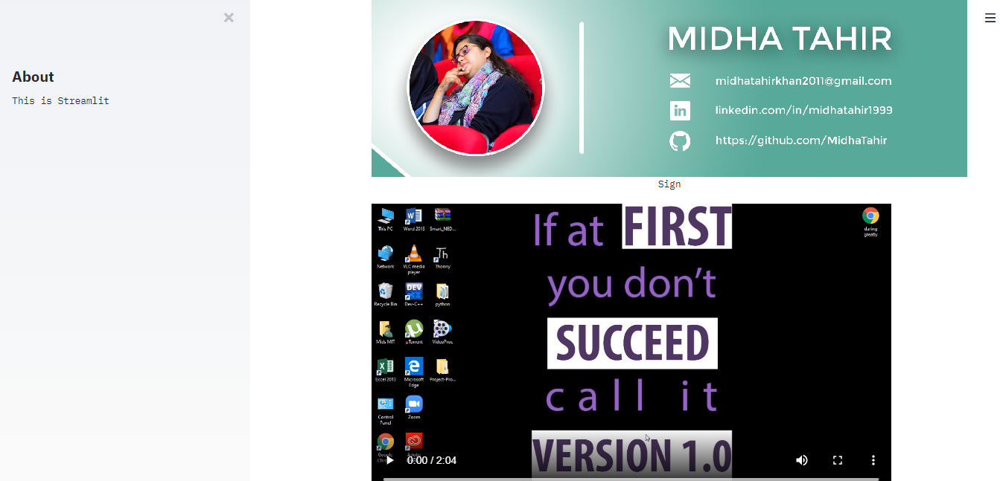
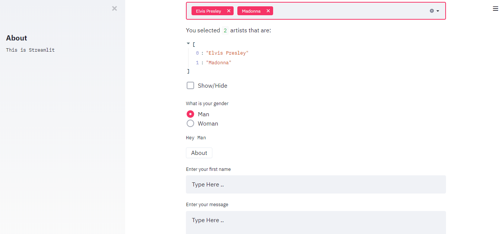
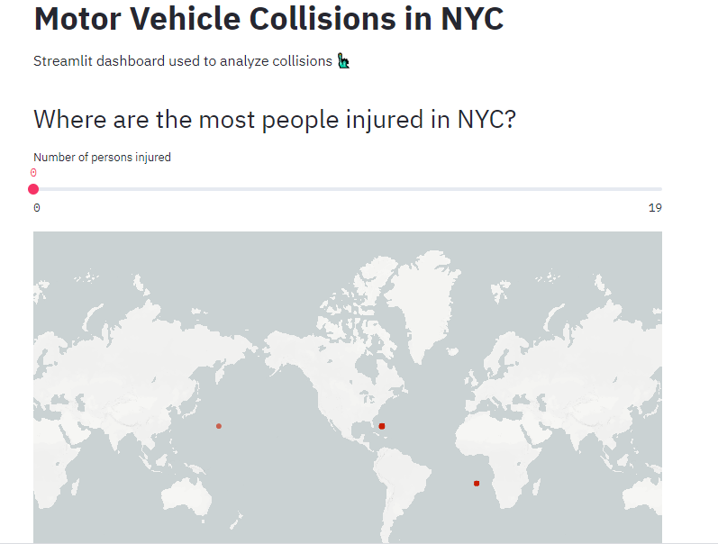
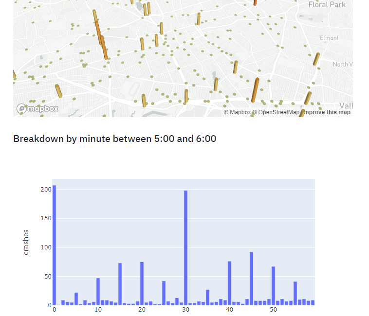
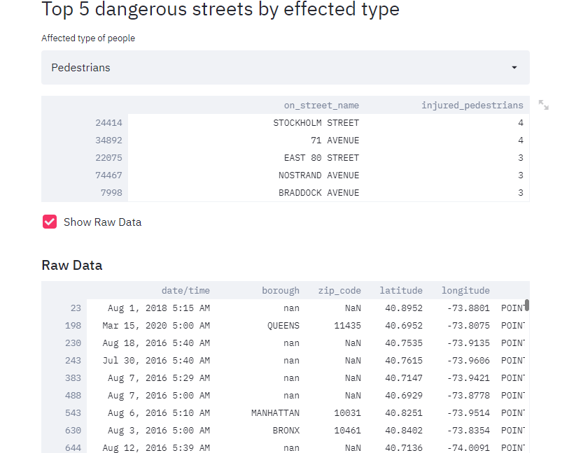

# Streamlit Applications

### What is Streamlit?

Streamlit is an open-source app framework for Machine Learning and Data Science teams. It helps to create beautiful web apps easily.

#### This repo includes:
_____
1.  Crash course app:
We can simply add pictures, videos and audios, selectbox, radio buttons. I followed this video tutorial
[Youtube Crash Course](https://www.youtube.com/watch?v=_9WiB2PDO7k).

[Video of project](https://github.com/MidhaTahir/StreamLit/blob/master/crash_course/streamlit-app.mp4).

___
2. Coursera project 
In this project , I have used Motor_Vehicle_Collisions_-_Crashes.csv for analysis. I followed this project tutorial for this [Coursera Project](https://www.coursera.org/learn/data-science-streamlit-python/home/welcome).

[Video of project](https://github.com/MidhaTahir/StreamLit/blob/master/coursera_project/streamlit-courseraapp.mp4).
